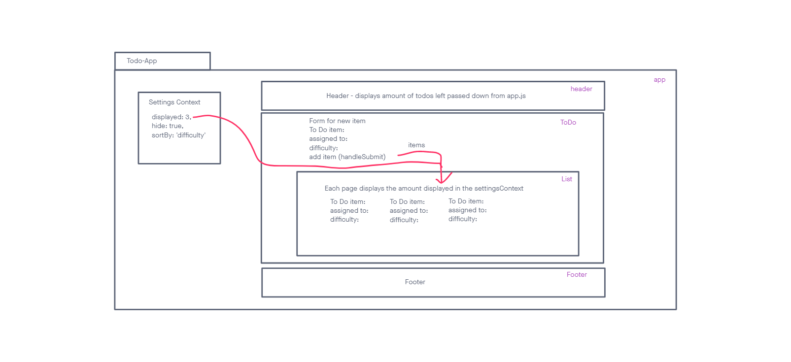

# LAB - Class 31

## Project: Todo-App

### Author: Seth Pierce

- [gitub link](https://github.com/sethppierce/todo-app)

### Problem Domain

Create a React App that allows users to track their tasks and add new ones.

### Documentation

Describe how global state is consumed by the components.
Global state is consumed by components through props, which are passed down from higher-level components to their children.

Describe the operation of the hook: useForm().
The useForm hook is a function that returns a form state object and a set of functions for updating that state. It can be used to manage the state of a form in a React application.

### Links and Resources

- [prod deployment](https://codesandbox.io/p/github/sethppierce/todo-app/draft/focused-neumann?create=true&file=%2FREADME.md&workspace=%257B%2522activeFileId%2522%253A%2522clcpnx46s000x7ok94zpvgdrp%2522%252C%2522openFiles%2522%253A%255B%2522%252FREADME.md%2522%255D%252C%2522sidebarPanel%2522%253A%2522EXPLORER%2522%252C%2522gitSidebarPanel%2522%253A%2522COMMIT%2522%252C%2522spaces%2522%253A%257B%2522clcpnx4z60018356g7x79p6fn%2522%253A%257B%2522key%2522%253A%2522clcpnx4z60018356g7x79p6fn%2522%252C%2522name%2522%253A%2522Default%2522%252C%2522devtools%2522%253A%255B%257B%2522key%2522%253A%2522clcpnx4z70019356gzdibb2yz%2522%252C%2522type%2522%253A%2522PROJECT_SETUP%2522%252C%2522isMinimized%2522%253Afalse%257D%252C%257B%2522type%2522%253A%2522PREVIEW%2522%252C%2522taskId%2522%253A%2522start%2522%252C%2522port%2522%253A3000%252C%2522key%2522%253A%2522clcpnxqmh00dd356g3gubgmxf%2522%252C%2522isMinimized%2522%253Afalse%257D%252C%257B%2522type%2522%253A%2522TASK_LOG%2522%252C%2522taskId%2522%253A%2522start%2522%252C%2522key%2522%253A%2522clcpnxn5n009g356gd6lksepi%2522%252C%2522isMinimized%2522%253Afalse%257D%255D%257D%257D%252C%2522currentSpace%2522%253A%2522clcpnx4z60018356g7x79p6fn%2522%252C%2522spacesOrder%2522%253A%255B%2522clcpnx4z60018356g7x79p6fn%2522%255D%257D) (when applicable)

### Setup

#### How to initialize/run your application (where applicable)

- npm i
- npm start

#### Features / Routes

Currently, a user can add todo tasks to the proof-of-life starter application. In this phase, we will add hard-wired, default context settings to the application so that the user can view three incomplete todo tasks. In addition, the user will have the option of viewing any additional incomplete tasks by using pagination functionality.

#### Tests

- npm test
- header
  - tests to see if pending item updates with props
- list
  - tests to see if the correct amount of items are displayed based off of the setting context
- settings
  - tests settingsContext to see if it initializes 

### UML

#### Phase 1 UML

