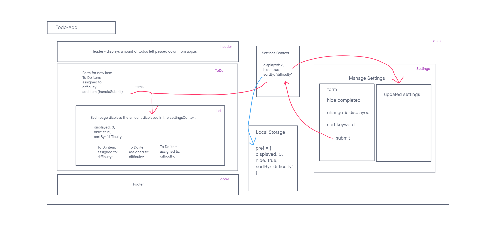
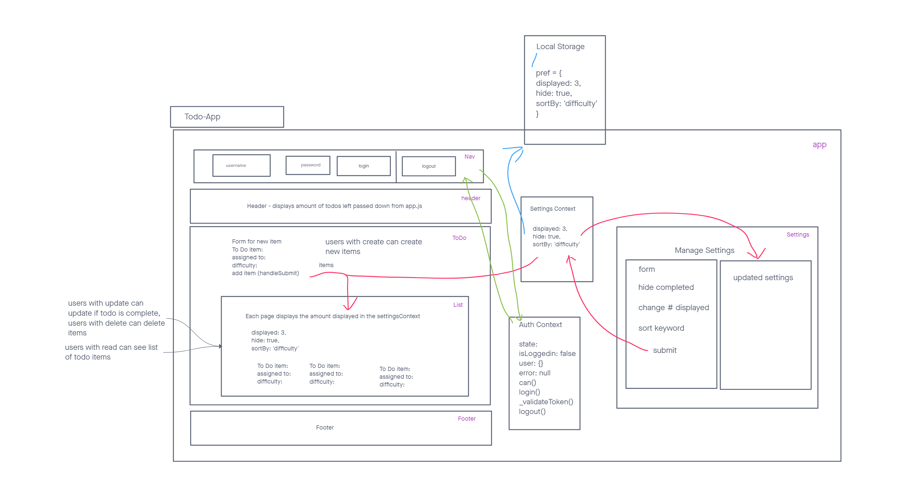
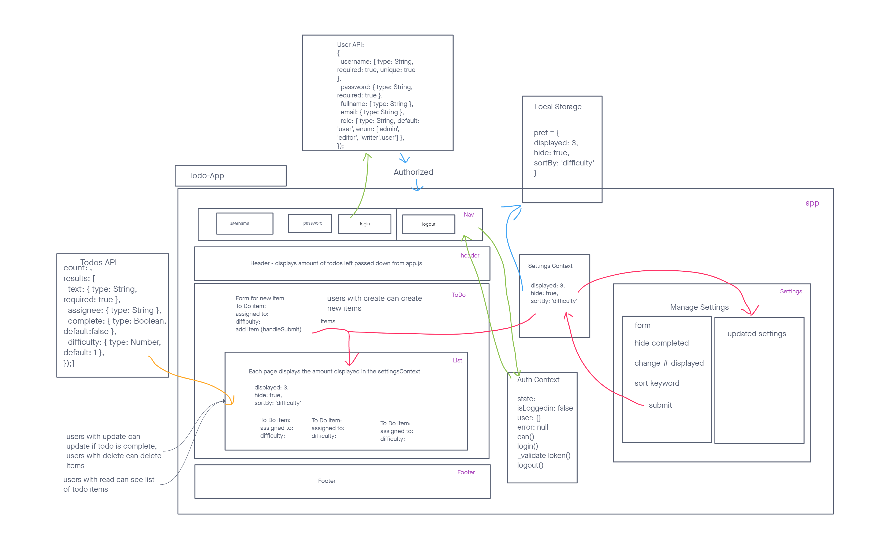

# LAB - Class 31

## Project: Todo-App

### Author: Seth Pierce

- [gitub link](https://github.com/sethppierce/todo-app)

### Problem Domain

Create a React App that allows users to track their tasks and add new ones.

### Documentation

Describe how global state is consumed by the components.
Global state is consumed by components through props, which are passed down from higher-level components to their children.

Describe the operation of the hook: useForm().
The useForm hook is a function that returns a form state object and a set of functions for updating that state. It can be used to manage the state of a form in a React application.

### Links and Resources

- [prod deployment](todo-app-spp.netlify.app) (when applicable)

### Setup

#### How to initialize/run your application (where applicable)

- npm i
- npm start

#### Features / Routes

Currently, a user can add todo tasks to the proof-of-life starter application. In this phase, we will add hard-wired, default context settings to the application so that the user can view three incomplete todo tasks. In addition, the user will have the option of viewing any additional incomplete tasks by using pagination functionality.

Settings editor to allow users to change preferences for the application.

In this final phase, we’ll be requiring that users be logged in, in order to see the to do items. Additionally, based on their user type, they will be allowed (or denied) to perform actions such as editing or deleting them.

In this final phase, we’ll be requiring that users be logged in through a live authentication server, in order to see the to do items. Additionally, based on their user type, they will be allowed (or denied) to perform actions such as editing or deleting them. All To Do items will be stored in a database, accessed through a deployed API.

#### Tests

- npm test
- header
  - tests to see if pending item updates with props
- list
  - tests to see if the correct amount of items are displayed based off of the setting context
- settings
  - test if preferences form initializes
  - test if preferences form changes values
  - test if updated settings card is not rendered when loaded
  - test if updated settings card is rendered when form is submitted
- context
  - tests settingsContext to see if it initializes context properly
  - tests authcontext to see if it initializes context properly
- nav
  - tests to see if login form is rendered intitially
  - tests to see if logout button is rendered after user logs in

### UML

#### Phase 1 UML

#### Phase 2 UML

#### Phase 3 UML

#### Phase 4 UML

